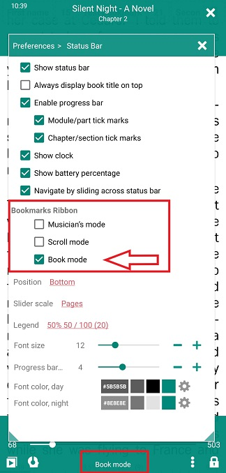
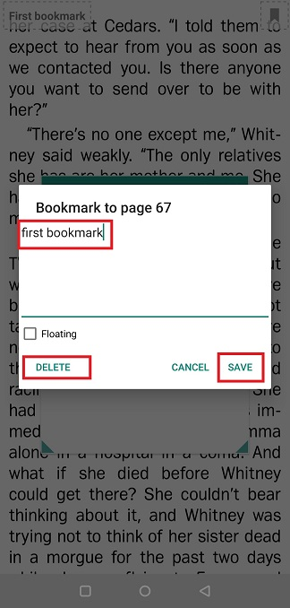

[<](/wiki/faq/zh)
{1}在扩展面板中使用书签(功能区书签)

>在Librera中，您可以在阅读屏幕上显示扩展的书签栏(Ribbon书签)。它具有快速添加书签，在书签之间切换的功能。

为了启用它，您必须：

{4}点击设置图标
{4}转到设置“状态栏”
{4}在所需的阅读模式下启用扩展书签面板(功能区书签)复选框。

||||
|-|-|-|
||||

接下来，您将看到如何在“读书”模式下使用快速书签栏。您可以在所有三种模式下重复这些操作，它们是相同的。

{6}如果您不再需要扩展的书签栏(Ribbon书签)，则可以通过从阅读模式中取消选中“状态栏”设置复选框来禁用它。右上角的书签图标将被删除。{6}

||||
|-|-|-|
||||

{6}添加书签：{6}

{4}点击屏幕右上角的书签图标
{4}选择“添加”书签
{4}对书签添加评论，将从该评论中为书签分配一个名称。在此示例中，注释“第一个书签”
点击“添加”

||||
|-|-|-|
||||

书签将添加到书签窗口中，并在顶部，扩展书签栏(Ribbon书签)中。现在，如果要转到此选项卡，只需在阅读时从面板顶部的顶部单击即可。如果要编辑它，请在书签窗口中长按该书签，将显示编辑窗口。另外，如果您有很多书签，则可以在扩展的书签栏(功能区书签)上滑动，以将它们向左或向右移动。

||||
|-|-|-|
||||

{6}添加快速书签{2}

{4}点击屏幕右上角的书签图标
{4}选择“快速书签”
{4}将创建“快速书签”。它会被赋予一个名称页号。如果您转到书签窗口，则会看到一个名为-15的“快速书签”。当您在书签窗口中长按一个书签时，将弹出编辑，删除窗口。

||||
|-|-|-|
||||

您可以使用快速操作在扩展的书签栏中添加或删除书签(功能区书签)：

{4}长按右上角的书签图标即可添加快速书签
{4}在扩展的书签栏中(丝带书签)长按书签名称，将提示您删除它。

