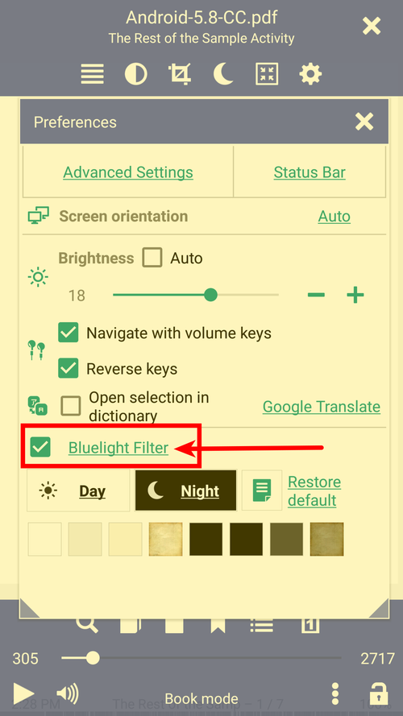

[<](/wiki/faq/es)

# Control de brillo y filtro de luz azul

> El control del brillo en **Librera Reader** puede ser automático, de acuerdo con la configuración de su sistema, o el usuario puede configurar el brillo manualmente.
El brillo se puede cambiar en la ventana **Preferencias**, o deslizando un dedo por el borde izquierdo de la pantalla (marque la casilla correspondiente para activar este modo).
El brillo negativo indica que su configuración es más oscura que la del sistema.
El brillo negativo habilita el filtro de luz azul con color negro de forma predeterminada.

* Configure el brillo para que cambie automáticamente según la luz ambiental
* Cambie el brillo deslizando el dedo por el borde izquierdo de la pantalla
* Toque la tostadora Brillo para cambiar al modo **Automático**
* Activa/desactiva las diapositivas del borde izquierdo en la pestaña **Configuración avanzada**

||||
|-|-|-|
||||

# filtro de luz azul
> El filtro de luz azul funciona junto con el brillo

* El filtro Bluelight se puede activar manualmente marcando su casilla en la ventana **Preferencias**
* El filtro de luz azul está activado
* Toque **Filtro de luz azul** para configurar su tono (color) preferido

||||
|-|-|-|
||||
