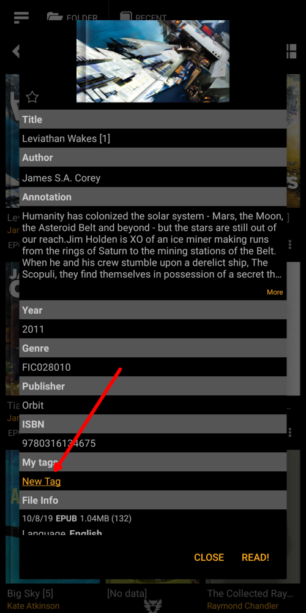

[<](/wiki/faq/it)

# Crea tag personalizzati

> Lo scopo di questo capitolo è capire perché è necessario tag # # book__ e come aggiungerli ai libri. Tagging è forma libera
parole che si adattano ai libri di qualsiasi file per organizzare meglio la libreria. È possibile assegnare molti tag allo stesso libro. I tag aiutano l&#39;utente a organizzare i libri
in collezioni. I tag aiutano l&#39;utente a trovare facilmente i libri in elenco o raccolte.
I tag sono metadati creati dall&#39;utente, ma esistono anche altri metadati come [Serie](), [Autori](), [Parole chiave](), [Generi]() che aiuta a
trovare e orginizzare raccolte di libri.

### Ci sono molti posti in cui l&#39;utente può __aggiungere tag__ al libro.

* Con un tocco prolungato sull&#39;icona stella (preferiti/it)
* Dal menu del libro
* Dalla finestra di dialogo delle informazioni del libro

|1|2|3|
|-|-|-|
||||

### L&#39;aggiunta di tag è molto semplice, basta fare clic

> Se cancelli il tag, questo tag verrà rimosso da tutti i libri assegnati

* Aggiungi Tag
* Crea un nuovo tag
* Elimina il tag assegnato

|4|5|6|
|-|-|-|
||||

### Crea elenchi e raccolte personalizzati

* Assegna tag al libro
* Trova tutti gli elenchi di tag nella scheda dei preferiti
* Ottieni tutti i libri per tag

|7|8|9|
|-|-|-|
||||

### Vedi le raccolte di tag dal libro

* Fai clic sull&#39;icona dei tag recenti
* Seleziona le raccolte che vuoi (libri preferiti o tag utente/it)
* Visualizzazione di libri per tag, fai clic per leggere qualsiasi libro

|10|11|12|
|-|-|-|
||||
