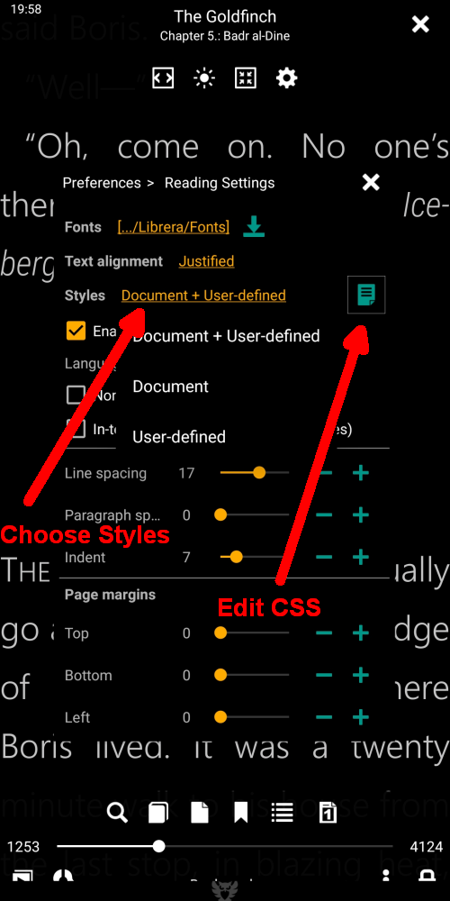
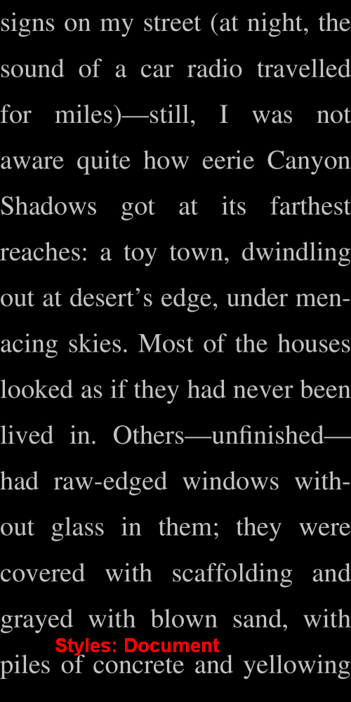

# Codage CSS personnalisé

> Pour le rendu du livre, **Librera** prend généralement les styles du fichier .css du livre et applique également vos paramètres à partir de la fenêtre **Préférences**. Il peut également utiliser l’un ou l’autre séparément. Mais parfois, cela ne suffit pas. Certains livres ont un code CSS si particulier que vous n’avez pas d’autre choix que de modifier leurs fichiers .css pour améliorer la lisibilité. Cependant, **Librera** vous offre une autre option: ajouter temporairement du code CSS personnalisé facilement amovible une fois que vous avez terminé avec le livre mis au défi.

Trois modes **Styles** sont pris en charge:

1. Document + défini par l'utilisateur (prend les bonnes choses des deux mondes)
2. Document (utilise uniquement les paramètres .css du livre)
3. Défini par l'utilisateur (utilise uniquement les paramètres définis par l'utilisateur dans les onglets de la fenêtre **Préférences**)

* L'utilisateur peut basculer entre les modes via une liste déroulante appelée en appuyant sur le lien en regard de _Styles_.
* Appuyez sur l'icône en regard de la liste _Styles_ pour ouvrir la fenêtre **Code CSS personnalisé** et y accéder.

|1|2|3|
|-|-|-|
||||

Le mode Document + défini par l'utilisateur est activé par défaut

L'exemple de la figure 3 est tiré de la vie réelle.

{white-space: pre-line;}
Les séquences d'espaces blancs sont réduites. Les lignes sont brisées aux caractères de nouvelle ligne, à   , et si nécessaire pour remplir les zones de ligne.

{white-space: pre;}
Les séquences d'espaces blancs sont conservées. Les lignes ne sont rompues que sur les caractères de nouvelle ligne de la source et sur   éléments.

span {display: block}
p&gt; span {display: inline}
Élimine les lignes vides très gênantes entre les pages (rectifiant les failles muPDF).
