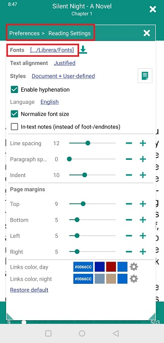

[<](/wiki/faq/de)

# So konfigurieren Sie Schriftarten und Stile

> Zum bequemen Lesen können Sie mit Librera das Erscheinungsbild Ihres Dokuments anpassen, Schriftarten und CSS-Stile ändern und einen Großbuchstaben hinzufügen.

Sie können die Schriftart und den Textstil in den Menüregistern anpassen:

* **Erweiterte Einstellungen**
* **Einstellungen lesen.**

Um auf diese Einstellungen zuzugreifen, klicken Sie auf das Einstellungssymbol.

||||
|-|-|-|
||||

## Erweiterte Einstellung

In diesem Menü-Tab können Sie die Dokumentschriftart für den **&quot;Benutzerdefiniert&quot;** -Dokumentstil ändern (eine Beschreibung der Stile finden Sie im Abschnitt **&quot;Leseeinstellungen&quot;** unten):

* Klicken Sie auf den Titellink der Schriftart
* Streichen Sie in der Dropdown-Liste der Schriftarten nach oben oder unten, und wählen Sie die gewünschte Schriftart aus.
* Wenn Sie Schriftarten zum Lesen herunterladen möchten, lesen Sie den folgenden Abschnitt **&quot;Leseeinstellungen&quot;**.

Wenn Sie die Schriftarten optimieren möchten:

* Klicken Sie auf das Symbol für das Schriftartkonfigurationsmenü
* Im Einblendmenü &quot;Einstellungen&quot; können Sie die Schriftart für jeden Texttyp ändern. Klicken Sie nach der Änderung auf &quot;Übernehmen&quot;.
* Schließen Sie die Einstellungen und lesen Sie weiter.

||||
|-|-|-|
||||

||||
|-|-|-|
||||

Für das Buchformat **fb2** können Sie den Buchstaben anpassen:

* Klicken Sie auf das Symbol für das Schriftartkonfigurationsmenü
* Aktivieren Sie das Kontrollkästchen &quot;Lead-Kapitel mit Initiativen&quot;
* Wählen Sie die Schriftart des Buchstabens aus
* Passen Sie Größe und Farbe an
* Klicken Sie auf &quot;Übernehmen&quot;, um die Einstellungen zu übernehmen.

||||
|-|-|-|
||||

## Einstellungen lesen

In diesem Abschnitt des Menüs können Sie mit Ihren Schriftdateien arbeiten, neue Schriften hinzufügen oder herunterladen. Festlegen der Anzeigestile von Text.

Um Schriften anzupassen, herunterzuladen oder neue hinzuzufügen, müssen Sie:

* Geben Sie ggf. den Pfad zu Ihren Zeichensätzen an, indem Sie den Zeichensatzordner auf Ihrem Gerät auswählen
Laden Sie weitere Schriften herunter, indem Sie auf das Symbol &quot;Schriften herunterladen&quot; klicken. Ein Bestätigungsfenster für den Download wird angezeigt. Klicken Sie auf &quot;Download&quot;.
* Die Schriftarten haben eine Größe von 10 Megabyte. Nach dem Herunterladen werden sie zur Auswahl in der allgemeinen Schriftartenauswahl auf der Menüregisterkarte **&quot;Erweiterte Einstellungen&quot;** angezeigt.

||||
|-|-|-|
||||

**Passen Sie die Stile des angezeigten Texts an.**

Mit dem Programm können Sie die Textanzeige und den Stil auswählen, die der Autor des Dokuments im Text festgelegt hat:

* Dokument - Verwendet den vom Autor des Dokuments festgelegten Textstil
* Benutzerdefiniert: Verwenden Sie Ihre Stileinstellungen für Schriftarten, Einrückungen und Markierungen des Dokuments
* Dokument + Benutzerdefinierte Benutzer- und Autorenstile werden zusammen verwendet.

Durch Klicken auf das Symbol für Stileinstellungen können Sie mithilfe der CSS-Sprache für Hypertext-Markups Ihre eigenen Textanzeigestile hinzufügen

||||
|-|-|-|
||||

||||
|-|-|-|
||||

