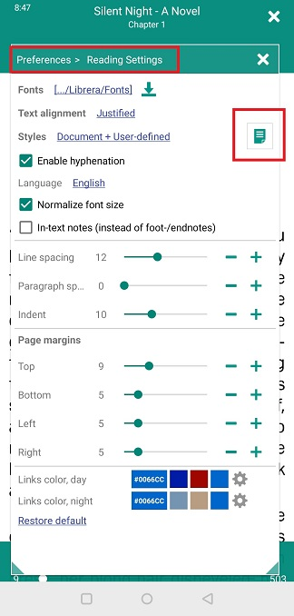

# Настройка шрифтов и стилей

> **Librera** позволяет настроить внешний вид документа, который вы читаете, - выбрать шрифты по своему вкусу, настроить их размер, настроить стили CSS и изменить первые буквы на начальные инициалы (FB2).

Все вышеперечисленное вы будете выполнять на главной вкладке окна **Предпочтения** и, очевидно, на вкладке _Reading Settings_.

> Нажмите значок **Настройки**, чтобы открыть окно **Настройки**.

||||
|-|-|-|
||||

## Корректировка шрифта

* Выберите основной шрифт, нажав на ссылку _Font_ и выбрав выпадающий список доступных шрифтов.

> Вы можете добавить свои любимые шрифты в список:
1. Создайте папку с именем _Fonts_ во внутренней памяти вашего устройства.
> Примечание. В вашем внутреннем хранилище есть еще одна _Fonts_ папка, уже созданная **Librera** автоматически.
2. Сохраните ваши любимые шрифты в вашей папке _Fonts_ (или в собственной папке **Librera** _Fonts_).
> (Вы также можете загрузить некоторые полезные шрифты с нашего сайта. Инструкции см. В разделе **Настройки чтения**.)
> Помните, что ваши шрифты будут учитываться только в том случае, если в _Styles_, выбранном вами на вкладке **Настройки чтения**, есть _User-define_.

Чтобы настроить пользовательские шрифты для различных стилей шрифта, нажмите значок рядом со ссылкой _Fonts_, чтобы открыть окно _Configure Fonts_.

* Нажмите настройку для каждого стиля и выберите шрифт для него.
* Используйте кнопки **вверх** и **вниз**, чтобы перейти к следующему шрифту в списке (иногда этого будет достаточно для вашей цели).
* Не забудьте нажать **APPLY**, когда закончите.

||||
|-|-|-|
||||

||||
|-|-|-|
||||

## Ведущие инициалы в книгах FB2

Вы можете сделать так, чтобы каждая глава в вашей книге начиналась с красивой заглавной буквы.
 
> Этот параметр не будет отображаться при чтении в любом другом формате.

* Нажмите значок рядом со ссылкой _Fonts_, чтобы открыть окно _Configure Fonts_
* Установите флажки _Lead с инициалами_, чтобы включить инициалы
* Нажмите на ссылку шрифта, чтобы выбрать шрифт для вашего начального из выпадающего списка
* Теперь выберите размер и цвет для вашего начального, нажав соответствующие ссылки
* Нажмите **ПРИМЕНИТЬ**, чтобы сохранить настройки

||||
|-|-|-|
||||

## Вкладка **Настройки чтения**

> Это настройки, определенные пользователем. Они в основном переопределяют настройки стиля, закодированные в файле .css вашей книги. Вам нужно выбрать стили, определенные пользователем, чтобы он работал.

* Выберите желаемое выравнивание текста из выпадающего списка.
* Используйте ползунки или касания **-** и **+**, чтобы отрегулировать интервал между строками и абзацами, отступы текста и поля страницы.
* Нормализуя font-size_, вы делаете все шрифты в документе равными (1em, обычный).
* Вы также можете указать цвет ссылок в документе для каждого режима (днем и ночью).

||||
|-|-|-|
||||

**Мудро выбирайте _Styles_ для своей книги**

* _Document_, будут использованы настройки книги .css
* _User-определенный_, настройки этой вкладки будут использоваться
* _Document + Пользовательский_ (по умолчанию, рекомендуется), наша попытка включить пользовательские настройки в настройки книги .css (или наоборот). Работает большую часть времени!

## Окно **пользовательского кода CSS**

Это окно открывается при нажатии на значок рядом с _Styles_

Те, кто знаком с CSS-кодированием, могут внести некоторые изменения в способ отображения вашей книги. (Подробнее см. В **FAQ по настройке стилей CSS книги**).

> Не забудьте удалить код, как только закончите с книгой! Это может не сработать в следующем.

||||
|-|-|-|
||||

||||
|-|-|-|
||||
