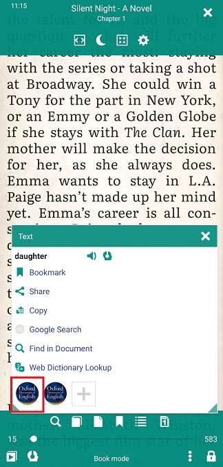

# Utilisation de dictionnaires et de traducteurs

> Lorsque vous lisez un livre, en particulier dans une langue étrangère, vous devrez peut-être rechercher le sens d'un mot que vous ne connaissez pas dans un dictionnaire. Avec **Librera**, vous pouvez le faire facilement, en un seul clic, en ligne et hors ligne.

**Librera** vous permet de rechercher un seul mot ou de traduire des passages entiers à l'aide de traducteurs en ligne (dictionnaires).

Il existe de nombreux **ONLINE** dictionnaires et traducteurs sur Internet. Ils vous permettent de vérifier la signification d'un mot sans rien installer sur votre appareil.
> **Librera** ouvre une fenêtre de navigateur contenant le mot sélectionné dans le champ de recherche du dictionnaire choisi.
 
Vous pouvez choisir parmi les options suivantes (pour n'en nommer que quelques-unes):

* Lingvo
* Oxford
* Longman
* Cambridge
* Macmillan
* Collins
* Merriam-Webster
* 1tudien
* Vdict
* Wikipedia
* Wiktionnaire
* Academic.ru
* Vocabulaire.com
* Deepl.com
* Treccani.it, etc.

**HORS LIGNE**: les dictionnaires et les traducteurs doivent être installés sur votre appareil à partir de Google Play (ou ailleurs). Ils feront apparaître une fenêtre avec la traduction ou la définition d'un mot sélectionné et ne comptent pas sur Internet pour fonctionner.

1. Voici une liste des dictionnaires et traducteurs gratuits les plus populaires sur Google Play:
* Google Translate
* Microsoft Translator
* Dictionnaire russe multitran
* dictionnaire Oxford
* Yandex.Translate, etc.
2. Vous pouvez également installer un **dictionnaire-shell**, qui gérera les dictionnaires créés par des compilateurs tiers, comme par exemple:
* GoldenDict
* Dictionnaire Fora, etc.
 
> **Si vous n'avez pas trouvé dans * Librera * la ressource en ligne que vous recherchez, veuillez envoyer votre demande aux développeurs à l'adresse librera.reader@gmail.com ou poser une question sur github.**

**Recherche de dictionnaire en un clic**
Pour activer la recherche immédiate dans le dictionnaire d'un mot sélectionné, vous devez:
* Ouvrez la fenêtre **Préférences** en appuyant sur l'icône **Paramètres**.
* Cochez la case _Open selection in dictionary_ dans l'onglet principal
* Sélectionnez un mot (ou une séquence de mots) par un appui long (et faites glisser).
||||
|-|-|-|
||||

**Configuration d'un dictionnaire par défaut**
Vous pouvez également configurer votre dictionnaire par défaut (celui dont la fenêtre apparaîtra lors de la sélection d'un mot):
* Appuyez sur le lien _Dictionary_ situé en regard de la zone _Open selection_
* Sélectionnez le dictionnaire que vous préférez dans la liste déroulante des dictionnaires et des traducteurs (Remarque: la liste contient des dictionnaires en ligne et hors ligne).

||||
|-|-|-|
||||

**Laisser la case de sélection décochée**
Si vous laissez la case _Open selection_ non cochée, la fenêtre **Texte** vous sera présentée lors de la sélection d'un mot ou d'une séquence de mots. Ici vous pourrez:
* Recherchez ou traduisez ce mot (séquence) dans la ressource en ligne de votre choix (en appuyant sur _Web Dictionary Lookup_)

||||
|-|-|-|
||||

* Recherchez (en appuyant sur **+** si nécessaire) votre dictionnaire ou traducteur installé préféré.
* Appuyez sur son icône pour afficher sa fenêtre contextuelle contenant le mot traduction (définition).

||||
|-|-|-|
||||

> Rappel rapide: N'oubliez pas de choisir votre dictionnaire par défaut AVANT de cocher la case _Open selection in dictionary_.

||||
|-|-|-|
||||
