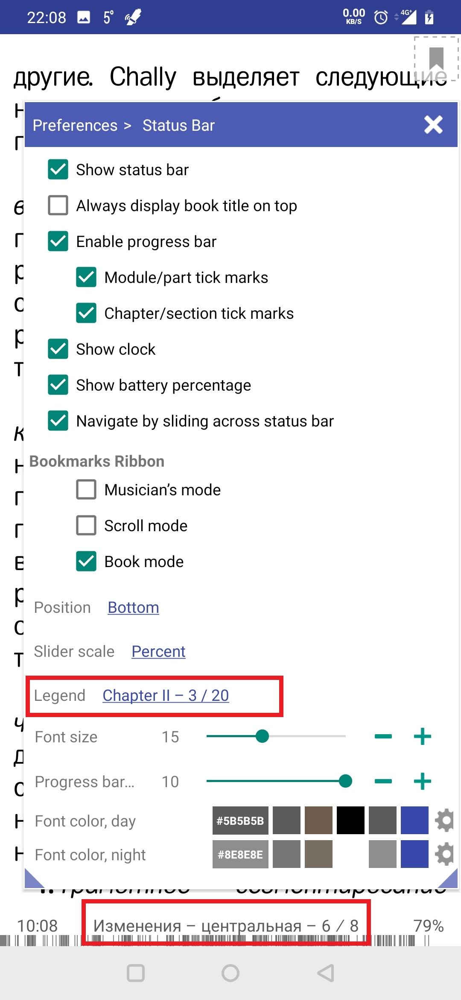
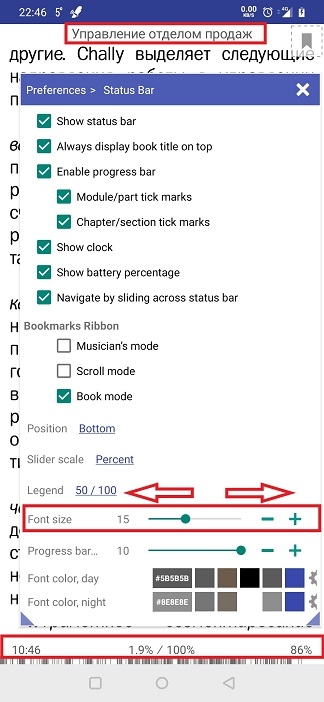

[<](/wiki/faq/de)

# Festlegen der Statusleiste

> Mit Librera können Sie die Benutzeroberfläche der Statusleiste flexibel konfigurieren und die Informationen anzeigen oder daraus entfernen, die Sie beim Lesen benötigen.

Um zu den Einstellungen in der Statusleiste zu gelangen, müssen Sie:
* Klicken Sie auf das Einstellungssymbol
* Wählen Sie ein Element im Menü &quot;Statusleiste&quot; aus

||||
|-|-|-|
||||

Nach den Aktionen gelangen Sie in die Statusleiste der Einstellungen, in der Sie Folgendes konfigurieren können:
* Aktivieren oder Deaktivieren der Anzeige der Statusleiste
* Passen Sie die Position oben oder unten auf dem Bildschirm an.

||||
|-|-|-|
||||

Ändern Sie die Art der Informationen zum Buch, die im Textteil der Statusleiste angezeigt werden

||||
|-|-|-|
||||

* Zeigen Sie den Buchtitel in der Statusleiste an
* Zeigt die aktuelle Uhrzeit an
* Der Prozentsatz der Akkuladung.

||||
|-|-|-|
||||

* Aktivieren oder deaktivieren Sie den Fortschrittsbalken
* Festlegen der Anzeige von Beschriftungen, die in der Fortschrittsleiste angezeigt werden
* Zeigt das Lesezeichensymbol an. Aktivieren Sie das Kontrollkästchen, in welchen Modi dieses Symbol angezeigt werden soll.

||||
|-|-|-|
||||

* Ändern Sie die Textgröße in der Statusleiste und in der Kopfzeile
* So ändern Sie die Größe der Statusleiste
* Ändern Sie die Farbe in der Statusleiste und in der Kopfzeile.

||||
|-|-|-|
||||
