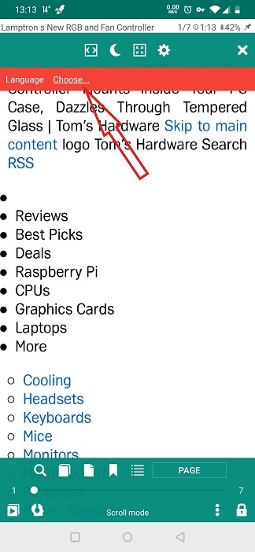

# Verwenden der TTS-Funktion zum Lesen von Freigaben aus anderen Apps
> Sie können Lesematerial mit **Librera** in jeder Anwendung auf Ihrem Gerät teilen, die das Teilen unterstützt.
> Sie können beispielsweise Webseiten, Artikel und andere interessante Inhalte aus dem Internet mit **Librera** teilen, diese speichern und die TTS-Tools von **Librera** verwenden.

So lesen Sie eine Webseite in **Librera** vor:
* Öffnen Sie die Seite in Ihrem Browser.
* Tippen Sie in Ihrem Browser-Menü auf das Symbol _Share_ (in unserem Beispiel Google Chrome).
* Wählen Sie **Librera** aus der Dropdown-Liste der verfügbaren Apps aus
* Wählen Sie einen Lesemodus für die Freigabe Ihres Browsers aus. Hinweis: Sie können sich den für zukünftige Referenzen ausgewählten Modus merken, indem Sie das entsprechende Kontrollkästchen aktivieren.

||||
|-|-|-|
||||

Sobald der Webartikel aus dem Browser in **Librera** geöffnet ist, können Sie die Lesbarkeit optimieren: Aktivieren Sie zunächst die Silbentrennung.

||||
|-|-|-|
||||

Jetzt können Sie **Librera** die Webseite laut vorlesen lassen:
* Tippen Sie unten links auf das **TTS** -Symbol
* Überprüfen Sie im Fenster **TTS-Einstellungen**, ob eine TTS-Engine installiert ist (oder wählen Sie die aus, die Sie verwenden möchten, wenn Sie über genügend TTS verfügen). Wenn es keine gibt, empfehlen wir Ihnen, die Google TTS Engine von Google Play zu installieren.
* Wählen Sie die Sprache für die Engine aus.
* Klicke auf _Play_ und genieße es.

> Sie können das Fenster **TTS-Einstellungen** schließen, wenn Sie keine weitere Feinabstimmung benötigen. Die Steuerelemente für die Wiedergabe bleiben zu Ihrer Bequemlichkeit am unteren Rand des Bildschirms.
* Tippen Sie zum Verlassen des TTS-Modus auf das Symbol _X_.

||||
|-|-|-|
||||
