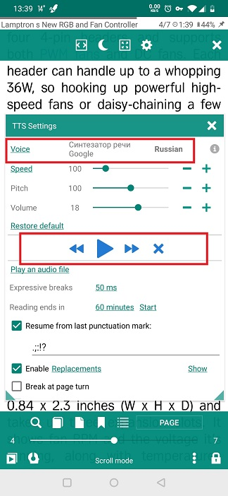

[<](/wiki/faq/pt)

# Como transferir texto do navegador da Web (para ler ou TTS)

> No Librera, você pode ler artigos do navegador da Internet, tanto por texto quanto por reprodução sexual.

 
Para ler no Librera, você precisa:

* Abra a página da web que você precisa no seu navegador. Para este exemplo, o navegador Сhrome será usado. Você pode usar seu navegador com a capacidade de compartilhar a página pelo navegador.

* Clique no ícone de compartilhamento no seu navegador da Internet

* Selecione Librera na lista suspensa de programas

* Selecione em qual modo de leitura Você deseja visualizar o texto transmitido no navegador. Ao marcar a caixa de seleção &quot;lembrar seleção&quot;, todos os textos subsequentes transferidos do navegador serão abertos no tipo de leitura que você escolheu.

||||
|-|-|-|
||||

Agora, o texto do navegador é aberto no Librera. Para facilitar a leitura, você pode adicionar hífens ao texto selecionando o idioma dos hífens que deseja.

||||
|-|-|-|
||||

Você pode reproduzir o texto por voz. Para reproduzir texto por voz, é usado o sintetizador de voz instalado no sistema Android.
Você não estabeleceu o que pode colocar no Google Play - Google Text-to-Speech.

* Clique no ícone de reprodução de voz

* Verifique se o sintetizador de voz está instalado, com o idioma de reprodução necessário

* Pressione Reproduzir, ouça o texto.

Se você fechar a janela de configurações ao reproduzir texto em fala, os botões de controle serão duplicados pelo subtexto e na cortina de notificação, para facilitar o gerenciamento. Para parar de ler, pressione pausa e cruze.

||||
|-|-|-|
||||
