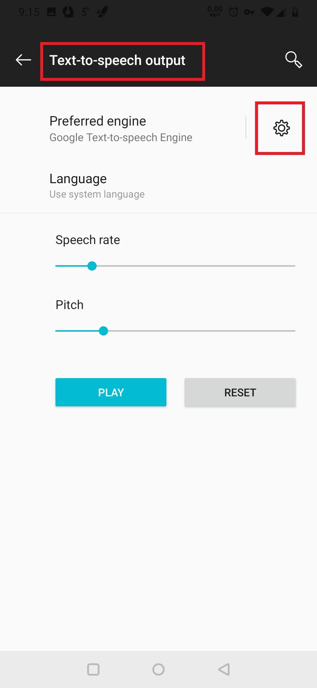

[<](/wiki/faq/fr)

# Installation et configuration de la synthèse vocale

> Librera vous permet d'exprimer le texte de vos documents à l'aide de synthétiseurs tiers installés sur le système Android. Texte-à-parole (TTS)

## Pour installer le synthétiseur vocal. Utilisation de l'exemple Google Text-to-Speech.

* Cliquez sur l'icône &quot;Lecture vocale du texte&quot;.
* Dans les paramètres TTS, sélectionnez l'icône **&quot;i&quot;**.
* Sélectionnez Synthétiseur vocal Google Text-to-Speech dans le menu déroulant. Vous allez accéder à Google Market, dans la section Installation du synthétiseur vocal. Cliquez sur &quot;installer&quot; le synthétiseur vocal Google Text-to-Speech.
* Après l'installation, retournez dans les paramètres TTS Librera.

||||
|-|-|-|
||||

## Pour configurer la synthèse vocale dans Google:

* Cliquez sur le lien &quot;Voix&quot;. Vous serez redirigé vers les paramètres Google Text-to-Speech
* Cliquez sur l'icône Paramètres de synthèse vocale de Google.
* Sélectionnez &quot;installer les données vocales&quot; - définissez la langue du synthétiseur vocal.
* Sélectionnez la langue de synthèse vocale dont vous avez besoin. Vous pouvez voir les langues en glissant vers le haut ou le bas
* Choisissez le type de son dont vous avez besoin, selon vos préférences.

Après avoir sélectionné toutes les options, cliquez sur &quot;Précédent&quot; dans la barre de navigation, revenez aux paramètres de synthèse vocale de Google, puis cliquez sur &quot;Lecture&quot;. Le message d'accueil du synthétiseur vocal Google avec la langue et le son de votre choix sera émis. Allez sur Librera, appuyez sur l'icône &quot;Lecture vocale du texte&quot;, appuyez sur &quot;Lire&quot; et écoutez votre livre.

||||
|-|-|-|
||||

||||
|-|-|-|
||||
