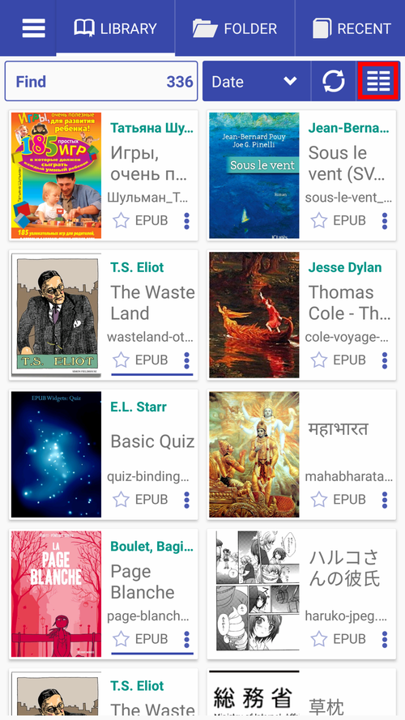

# Navegando na guia _Library_

> Uma vez instalado, o **Librera** por padrão será aberto com sua guia _Library_, repleta de informações úteis sobre os livros (e outros documentos) encontrados no seu dispositivo. Aqui está um guia rápido em torno da guia _Library_.

* A guia _Library_, exibição padrão
* Classifique os livros nas prateleiras da sua biblioteca de acordo com certos critérios (por nome do arquivo, autor, data etc.)
* Você pode alterar a maneira como seus livros são exibidos nas prateleiras, alterando o layout da Biblioteca (lista, grade, capa de livro etc.)

||||
|-|-|-|
||||

* Visualização condensada (duas colunas)
* Visualização em grade
* Apenas capas de livros

||||
|-|-|-|
||||

* Encontre livros em sua biblioteca
* Toque no ícone de estrela para adicionar um livro aos **Favoritos**
* Toque no ícone de três pontos para abrir o menu do livro
* Uma pressão longa no ícone de estrela solicitará que você adicione uma tag personalizada
* Toque em #History para adicionar uma tag personalizada a um livro
* Pressione e segure a capa do livro para abrir a janela **Informações do livro**

||||
|-|-|-|
||||

* Encontre um livro por extensão (FB2, no nosso exemplo abaixo)
* Toque no nome do autor para encontrar todos os livros desse autor na Biblioteca.
* Toque em _x_ para limpar os resultados da pesquisa
* Pressione e segure a marca de seleção para visualizar e editar o histórico de pesquisa e a lista de preenchimento automático.
* Veja **Informações do livro** e verifique até onde você está neste livro (Dica: você pode redefinir o progresso da leitura através do menu do livro)

||||
|-|-|-|
||||
