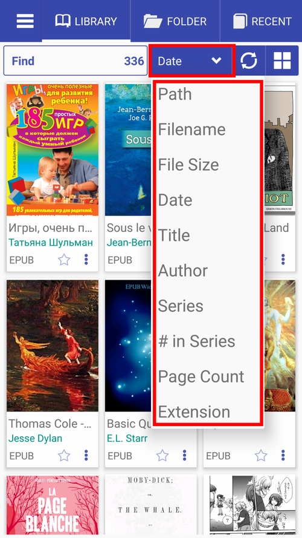
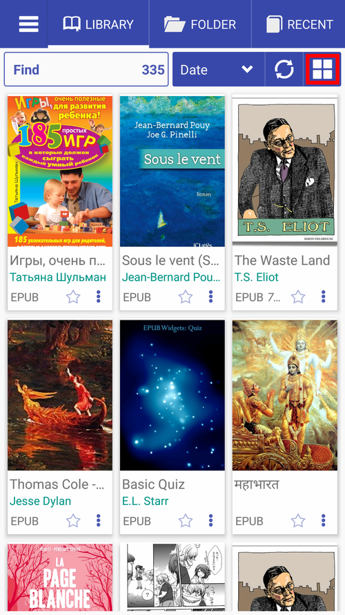

{1}导航_Library_选项卡

>安装完成后，默认情况下，**Librera**将打开并带有_Library_标签，其中包含有关设备上找到的书籍(和其他文档)的有用信息。这是有关_Library_标签的快速指南。

{4}“库”标签，默认视图
{4}根据某些标准(按文件名，作者，日期等)对图书馆书架上的书籍进行排序
{4}您可以通过更改图书馆的布局(清单，网格，书籍封面等)来更改书籍在书架上的展示方式。

||||
|-|-|-|
||||

{4}精简(两列)视图
{4}网格视图
{4}仅书籍封面

||||
|-|-|-|
||||

{4}在您的图书馆中查找书籍
{4}点击星标以将书添加到{3}收藏夹{6}
{4}点击三点图标以打开图书菜单
{4}长按星标会提示您添加自定义标签
{4}点击＃历史记录可向书中添加自定义标签
{4}长按书籍封面即可打开{3}书籍信息{2}窗口

||||
|-|-|-|
||||

{4}按扩展名查找书籍(在下面的示例中为FB2)
{4}点击作者的名字，即可在图书馆中找到该作者的所有书籍
{4}点击_x_清除搜索结果
{4}长按勾号可查看和编辑搜索历史和自动完成列表
{4}查看{3}图书信息{2}，并查看您对这本书有多远(提示：您可以通过“图书”菜单重置阅读进度)

||||
|-|-|-|
||||
