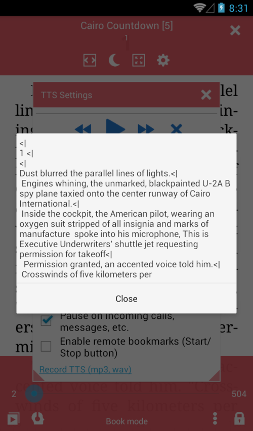

# TTS更换

>文本到语音替换用于更改引擎发音某些单词的方式，在阅读时跳过某些字符或设置正确的重音标记。

{4}启用TTS替换
{4}显示带有替换结果的段落
{4}“ {3}替换{2}”对话框，用于设置替换规则

|1|2|3|
|-|-|-|
||||

支持经典替换(将一个字符串直接更改为另一个字符串)，或者您可以使用正则表达式(RegExp)。

##表达式

{4}“文字”-简单文字
{4}“ *文本”-* RexExp规则
{4}“＃text”-禁用的规则
{4}“ text256”-禁用的规则

＃{1}示例

{4}“解放”。 -&gt;“库”-替换库。与Librera
{4}“ Librera”-&gt;“Libréra”-添加正确的压力标记
{4}“＃Lib。” -&gt;“图书馆”-使用“＃”禁用规则
{4}“ *(L | l)ib。” -&gt;“ $ 1ibrera”-替换Lib。与Librera和lib。与librera
{4}“ * [()”«»*“”/[]“-&gt;”“-跳过字符
{4}“ * [？！：;; – | – | ―]”-&gt;“，”-用暂停(，)替换字符

##添加规则文件

**Librera**支持**@Voice Reader**的RegExp规则文件
在下面查看此示例**demo-replaces.txt**：

```
" живого " "живо́ва"
" как глаза " " как глаза́ "
" мне глаза" " мне глаза́"
" наклоняющая головы" "наклоня́ющая го́ловы"
" никакого стрелка" "никако́во стрелка́"
" ПОЖАРОБЕЗОПАСНУЮ СРЕДУ" "пожарабезопа́сную среду́."
" Стрелки!" "Стрелки́!"
" стрелки?" "стрелки́?"
", все так," ", всё так,"
"Зачем, стрелок?" "Зачем, стрело́к?"
"стрелок?" "стрело́к?"
*"(?i)\b\Q душа в душу\E\b" "душа́ в ду́шу"
*"(?i)\b\Q подогнулись\E\b" "падагну́лись"
*"(?i)\b\Q стрелки почувствовали\E\b" "стрелки́ почувствовали"
*"(?i)\b\Q стрелки продолжили\E\b" "стрелки́ продолжили"
*"(?i)\b\Q стрелку из\E\b" "стрелку́ из"
*"(?i)\b\Q стрелок\E\b" "стрело́к"
*"(?i)\b\Q стрелы\E\b" "стре́лы"
*"(?i)\b\Q*\E\b" "сно́ска"
*"(?i)\b\Q1 курса\E\b" "1-го курса"
*"(?i)\b\Q171 группы\E\b" "171-ой группы"
*"(?i)\b\Q1977\E\b" "1977-ой"
*"(?i)\b\QAcapela\E\b" "Акапэ́'ла"
*"(?i)\b\QBIOS\E\b" "БИ́“О́С"

*"(^| )(Д|д)-р" " доктор"
"(^| )(Г|г)-н" " господин"
*"(\d+)\s?-\s?я\b(?# ""я"" на границе слова)" "$1-я "
```
