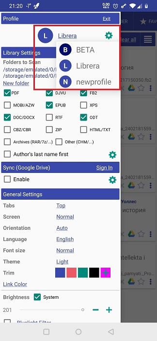

{1}使用配置文件

> Librera允许您添加和配置许多配置文件，并保留程序的每个单独设置及其主题。

##要添加新的配置文件，您必须：

{4}在个人资料设置面板中，点击设置图标
{4}点击链接“新个人资料”
{4}指定新配置文件的名称，然后单击添加。例如，创建一个名为“新配置文件”的配置文件
{4}在个人资料设置中，我们创建的个人资料将显示为“新个人资料”。

||||
|-|-|-|
||||

##要选择您创建的配置文件：

{4}点击当前个人资料
{4}从下拉列表中选择所需的配置文件
{4}确认配置文件切换。

||||
|-|-|-|
||||

>如果需要将“当前”配置文件中的所有Librera设置重置为原始状态(如首次安装后一样)，则可以分几个阶段完成。

##为了进行重置，您需要：

{4}点击左上角以显示菜单，或从左向右滑动菜单
{4}长按所需的个人资料名称
{4}确认您的操作“确定”

*确认后，程序将重新启动并将所有设置重置为默认值。*

{6}您添加的书签，标签和阅读进度不会在重置时删除。{6}

||||
|-|-|-|
||||

##要删除个人资料：
{4}通过切换到其他个人资料退出要删除的个人资料
{4}点击配置文件块中的设置图标
{4}点击要删除的个人资料旁边的删除图标
{4}确认个人资料删除。

||||
|-|-|-|
||||

