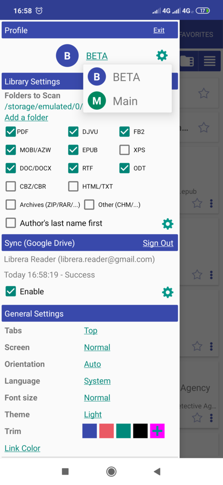

[Quoi de neuf](/wiki/what-is-new/fr)

# 8.1

En utilisant cette application, vous acceptez les conditions de la [Politique de confidentialité](/wiki/PrivacyPolicy/fr)

**Nouvelles fonctionnalités**

* Synchroniser avec Google Drive (progrès, signets, livres)
* Profils
* Les remplacements, marques de soulagement, règles RegEx dans TTS
* Autres paramètres en mode Musicien

# Synchroniser avec Google Drive

Sync vous permet de tout synchroniser dans le nuage et de lire le même livre sur de nombreux appareils.
avec enregistrer des progrès. Sync si GRATUIT dans toutes les applications Librera.

* Synchroniser la progression de la lecture de tous les livres (synchronisés et non synchronisés). Si vous pouvez utiliser le même nom de livre
la progression des appareils sera synchronisée automatiquement
* Synchroniser les favoris
* Liste récente de synchronisation
* Synchroniser les livres et les tags favoris

Exemples de synchronisation

* Activer la synchronisation avec Google Drive
* Cliquez sur le menu du livre pour synchroniser un livre.
* Tous les livres synchronisés dans l'onglet Favoris

||||
|-|-|-|
||||
 
 
# Profils

Profils est comme une installation d'application séparée avec différents paramètres, livres, progression du livre, signets.
Vous pouvez créer et supprimer des profils. Toutes les applications Librera utilisent les mêmes profils dans toutes les applications.
Profils stockés dans la mémoire interne du périphérique /sdcard/Librera/profile.[NAME]
Dans ce dossier, tous les paramètres, signets, progrès enregistrés dans les fichiers JSON.
Vous pouvez le voir mais ne le modifiez pas manuellement.

**Un clic long sur** le nom du profil affichera une boîte de dialogue pour restaurer les paramètres par défaut (les signets et la progression ne sont pas clairs).

||||
|-|-|-|
||||

# Le remplace dans TTS

* Activez &quot;Repalces&quot;, puis ajoutez des règles.
* Ajouter une règle pour remplacer tous les caractères de la liste par un autre &quot;[/.,]&quot; -&gt; &quot;&quot;
* Remplacer un mot par un autre &quot;lib&quot; -&gt; &quot;Librera&quot;
* Ajoutez des marques de contrainte (si le moteur TTS le prend en charge) &quot;Librera&quot; -&gt; &quot;Libréra&quot;
* Afficher le texte du résultat avec remplace dans la boîte de dialogue
* Prise en charge de @Voice Aloud externe .txt RegEx remplace le fichier

||||
|-|-|-|
||||

# Autres paramètres en mode Musicien

* Afficher \ masquer les rectangles des zones de prise
* Marquez la dernière page avec des lignes rouges (petites et grandes)
* Souligner les séparations de pages
* Cliquez sur la page suivante de la dernière page pour accéder à la première page.
* Cliquez sur la première page pour accéder à la dernière page.

||||
|-|-|-|
||||

# Améliorations de l'interface utilisateur

* Partager \ copier la page en tant que imge \ text (clic long sur l'aperçu de la page)
* Prise en charge des écrans cochés (découpés)
* Trier le livre par **éditeur** et **date de publication**

||||
|-|-|-|
||||

# Autres

* Support MathML et SVG (activation dans les options avancées, le premier chargement du livre est très lent)
* Option de bibliothèque permettant d'ignorer l'extraction de métadonnées dans les livres
* Mot de passe du doigt pour ouvrir l'application (Android 9+)
* Définir le délai d'extinction de l'écran en minutes ou en valeur système


 
