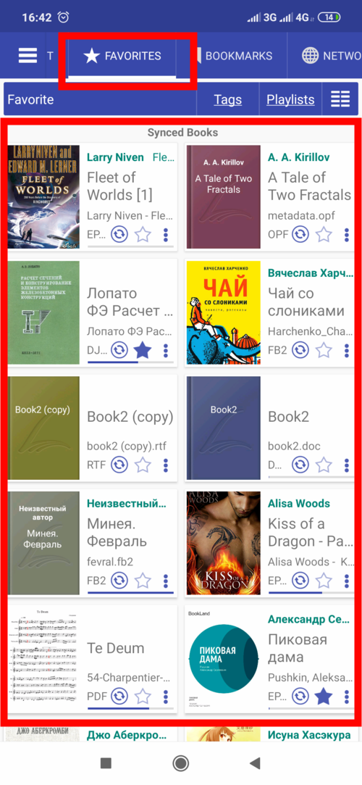
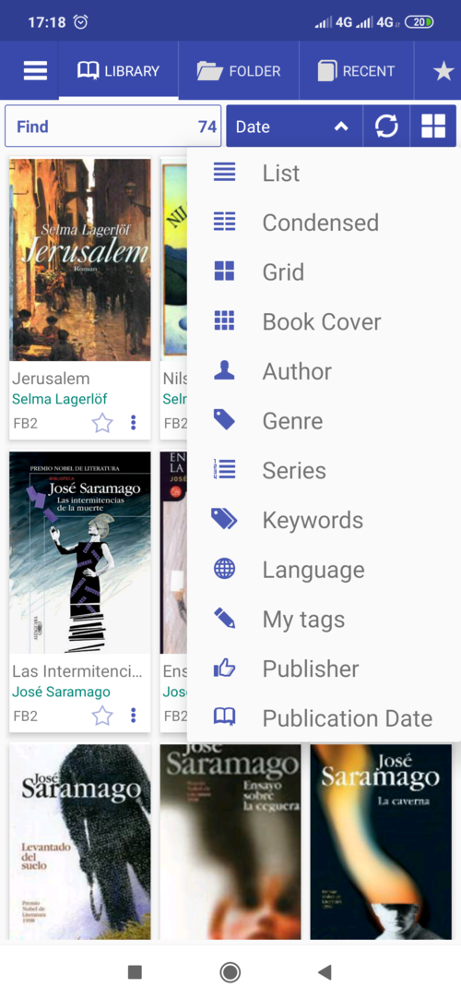

# 8.1

En utilisant cette application, vous acceptez les conditions de la [Politique de confidentialité](/wiki/PrivacyPolicy/fr)

**Nouvelles fonctionnalités et améliorations**

* TTS: enregistrement de livres entiers ou de plages de pages dans des fichiers MP3 (une page par fichier)
* Synchronisation sur des appareils Android via Google Drive (progrès de la lecture, signets, etc.)
* profils multiples
* TTS: remplacements de caractères, marques de contrainte manuelle, règles RegEx
* Paramètres supplémentaires et navigation en mode Musician
* Fonctions supplémentaires accessibles via l'interface utilisateur
* Améliorations diverses apportées à l'interface utilisateur et aux fonctionnalités

# Synchronisation via Google Drive

La synchronisation est destinée à être utilisée sur plusieurs appareils Android connectés à Google Drive. En lisant un livre, vous pourrez lire votre tablette la nuit là où vous l'avez laissée au téléphone pendant la journée. La synchronisation est prise en charge par **toutes les** applications de la famille Librera. Et c'est GRATUIT.

Vous pouvez synchroniser les paramètres suivants:

* Lecture Progression de tous les livres que vous lisez actuellement (synchronisés ou non). Conservez les mêmes noms de fichiers sur tous vos appareils et vos livres seront automatiquement synchronisés.
* Signets
* Liste récente
* Favoris et tags

Exemples de synchronisation

* Activer la synchronisation via Google Drive (vous devez disposer de vos informations d'identification Google)
* Pour synchroniser un livre, appelez son menu et choisissez _Sync_
* Tous vos livres de l'onglet Favoris seront synchronisés.

||||
|-|-|-|
||||
 
 
# Profils

Utiliser des profils revient à avoir plusieurs instances de Librera installées sur votre appareil, chacune avec ses paramètres, ses listes de lecture, ses progrès de lecture et ses signets distincts. Vous êtes autorisé à créer de nouveaux profils et à supprimer les anciens. Toutes les applications de la famille Librera ont cette fonctionnalité.

Les profils sont stockés dans la mémoire interne de l'appareil sous /sdcard/Librera/profile.[NAME]. Leurs paramètres, signets, progrès de lecture sont stockés dans des fichiers JSON, qui peuvent être visualisés avec n’importe quel visualiseur JSON (évitez toutefois de les modifier!).

Un **appui long sur** sur un nom de profil ouvrira une fenêtre d'alerte vous permettant de restaurer ses paramètres (initiaux) par défaut (vos signets et votre progression de lecture resteront intacts).

||||
|-|-|-|
||||

# Remplacements et dictionnaires TTS

* Appuyez sur &quot;Remplacements&quot; dans **Paramètres TTS** et ajoutez une nouvelle règle de lecture.
* Remplacer un ensemble de caractères (entre parenthèses) par un seul caractère à lire ou à ignorer
* Remplacez un mot par un autre, par exemple, &quot;lib&quot; -&gt; &quot;Librera&quot;
* Ajoutez des marques de contrainte manuellement (si votre moteur TTS le prend en charge): &quot;Librera&quot; -&gt; &quot;Libréra&quot;.
* Appuyez sur &quot;Afficher&quot; pour afficher les résultats des remplacements.
* Ajouter un dictionnaire externe: Librera prend en charge les fichiers de remplacement @Voice Aloud et .txt RegEx.

||||
|-|-|-|
||||

# Paramètres supplémentaires en mode Musicien

* Afficher \ masquer les zones de frappe (délimitées par des lignes en pointillés)
* Indiquez la dernière page avec des bandes rouges (étroites et larges)
* Mettez en surbrillance les séparateurs de page pour améliorer la lisibilité
* Naviguez de la première à la dernière page en appuyant sur la zone Page précédente
* Naviguez de la dernière à la première page en touchant la zone Page suivante

||||
|-|-|-|
||||

# Fonctions supplémentaires et améliorations de l'interface utilisateur

* Partager \ copier des pages en tant qu'images \ texte (appuyez longuement sur une vignette de page dans la fenêtre _Allez à parcourir)
* Prise en charge des écrans cochés
* Nouveaux paramètres de tri: trier par **éditeur** et **date de publication**

||||
|-|-|-|
||||

# Divers

* Prise en charge des formats MathML et SVG. Activez-le dans les options avancées (peut ralentir le chargement du livre initial)
* Option permettant d'ignorer les métadonnées dans les vues Bibliothèque et Dossier (seuls les noms de fichiers seront affichés)
* Signet mobile, avec indicateur flottant (marque automatiquement votre position de lecture actuelle et vous permet d'y revenir, via un flotteur situé dans le coin inférieur droit, après des visites temporaires dans d'autres parties et sections du livre). Pour créer (ajouter) un signet mobile, cochez la case **Flottante**.
* Autoriser l'utilisation des empreintes digitales à la place du mot de passe (Android 9+)
* Autoriser l'utilisation du délai de mise en veille du système pour éteindre l'écran

