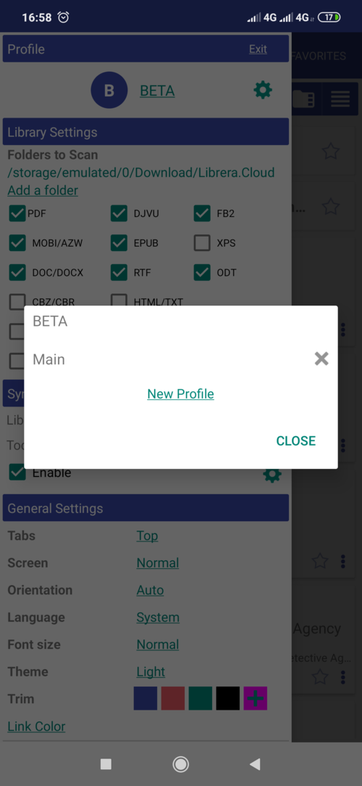

[What Is New](/wiki/what-is-new)

# 8.1

By using this app you agree to the terms of the [Privacy Policy](/wiki/PrivacyPolicy/)

**New Features and Improvements**

* Syncing across Android devices via Google Drive (reading progress, bookmarks, etc.)
* Multiple profiles
* TTS: character replacements, manual stress marks, RegEx rules
* Additional settings and navigation in Musician's mode
* Additional functions reachable through UI
* Miscellaneous improvements to UI and functionality 

# Syncing via Google Drive

Syncing is intended to be used on multiple Android devices connected to Google Drive. While reading a book, you will be able to pick up on your tablet at night right where you left off on your phone during the day. Syncing is supported by **all** apps of the Librera family. And it's FREE.

You can sync the following parameters:

* Reading Progress for all the books you're currently reading (either synced or not). Keep the filenames the same across all your devices, and your books will be synced automatically
* Bookmarks
* Recent list
* Favorites and tags

Examples of Syncing

* Enable Syncing via Google Drive (need to have your Google credentials handy)
* To sync a book, invoke its menu and choose _Sync_
* All your books in the Favorites tab will be synced

||||
|-|-|-|
||||
 
 
# Profiles

Using profiles is like having multiple instances of Librera installed on your device, each with its separate settings, booklists, reading progresses, and bookmarks. You are allowed to create new profiles and delete old ones. All apps of the Librera family have this feature.

Profiles are stored in the device's internal  memory  at /sdcard/Librera/profile.[NAME]. Their settings, bookmarks, reading progresses are stored in JSON files, which may be viewed w/ any JSON-viewer (refrain from modifying them, though!).

A **long press** on a profile name will pop up an alert window for you to restore its default (initial) settings (your bookmarks and reading progresses will remain intact).

||||
|-|-|-|
||||

# TTS Replacements and Dictionaries

* Tap "Replacements" in **TTS Settings** and add a new reading rule.
* Replace a set of characters (in brackets) w/ a single character to be either read or ignored
* Replace one word for another, e.g., "lib" -> "Librera"
* Add stress marks manually (if your TTS engine supports it): "Librera" -> "Libréra"
* Tap "Show" to see the replacements results
* Add an external dictionary: Librera supports @Voice Aloud and .txt RegEx replacements files

||||
|-|-|-|
||||

# Additional Settings in Musician's Mode

* Show\hide tap zones (delineated w/ dotted lines)
* Indicate last page w/ red stripes (narrow and wide ones)
* Highlight page separators to improve readability
* Navigate from first to last page by tapping Previous Page zone
* Navigate from last to first page by tapping Next Page zone

||||
|-|-|-|
||||

# Additional Functions and Improvements to UI

* Share\copy pages as images\text (long-press on a page thumbnail in the _Go to Page_ window)
* Support for notched screens
* New sorting parameters: sort by **Publisher** and **Publication date**

||||
|-|-|-|
||||

# Miscellaneous

* Support for MathML and SVG formats. Enable it in Advanced options (may slow down initial book loading)
* Option to ignore metadata in the Library view (only filenames will be used)
* Movable bookmark, with a floating indicator (automatically bookmarks your current reading position and allows you to jump back to it, via floater in the bottom-right corner, after temporary visits to other parts and sections of the book). To initiate (add) a movable bookmark, check the **Floating** box
* Allow fingerprint to be used instead of password (Android 9+)
* Allow the system sleep timeout to be used for turning screen off 


 
